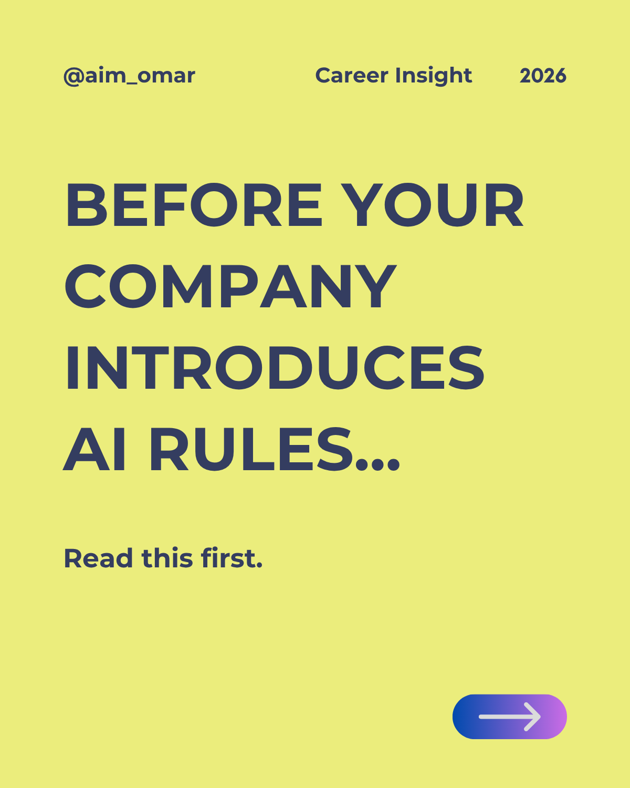

# Responsible AI for Technical Communicators

---

## Overview

Artificial intelligence is becoming a standard workplace tool—but organizations are increasingly focusing on **how employees use AI responsibly**, not simply whether they use it.

This educational LinkedIn carousel explores how AI governance may influence the work of technical communicators. Using the European Union's AI Act as a starting point and referencing broader international developments, it introduces the idea that responsible AI use is becoming an important professional skill.

Rather than explaining regulations in detail, the carousel serves as a practical introduction to the types of AI policies, governance practices, and workplace expectations that documentation teams may encounter.

---

## Topics Covered

- The EU AI Act and why it matters
- AI governance beyond Europe
- Workplace AI policies
- Responsible AI in documentation
- Human review and professional judgment
- Preparing for future AI guidance

---

## Who Is This For?

- Technical Writers
- Documentation Specialists
- UX Writers
- Content Designers
- Knowledge Managers
- Localization Professionals
- Technical Communication Students

---

## Skills Demonstrated

- Technical Writing
- Content Strategy
- Information Architecture
- AI Governance Awareness
- Educational Content Design
- Knowledge Management
- Technical Communication

---

## Key Takeaways

- AI governance is becoming part of professional practice.
- Responsible AI use extends beyond prompt writing.
- Human judgment remains essential in technical communication.
- Documentation teams should prepare for evolving workplace expectations.

---

## Sources

- European Commission – EU AI Act
- tcworld – *What the EU AI Act Means for Tech Writers*
- Diligent – *AI Regulations Around the World*

---

## Tools

- Canva
- ChatGPT
- GitHub

---

## Author

**Aim Omar**

Technical Writer

LinkedIn: https://linkedin.com/in/aim-omar
